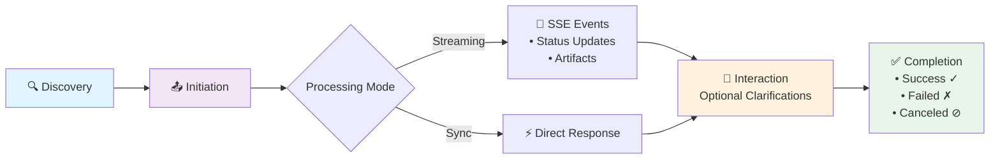
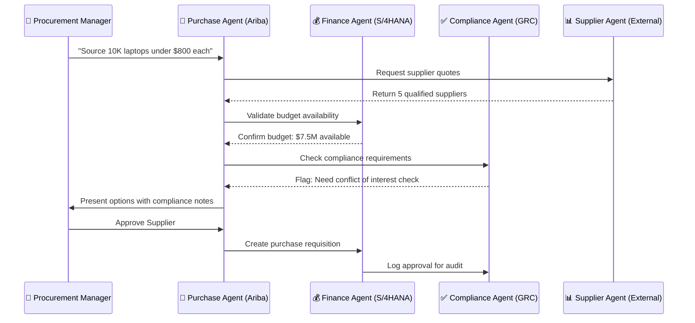
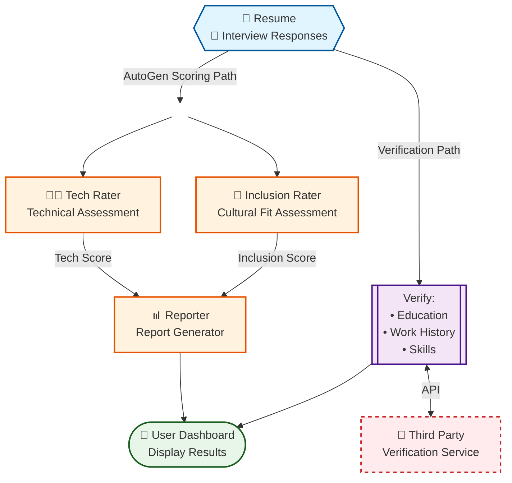

# 🚀 A2A-Powered Agentic AI: Design Your Own Hiring Assistant
## Building Intelligent & Inclusive Recruitment Systems

---

## 🌟 Table of Contents

1. **Agentic AI Introduction**
2. **Technical Deep Dive: AutoGen & A2A Framework**  
3. **The Diversity Imperative: Why Inclusion for AI Matters**
4. **Hands-On Journey: Step-by-Step Implementation**
5. **Live Demo: Transforming Recruitment Styles**
7. **Impact & Future Vision**
## 🔮 Part 1: Agentic AI Introduction

### What is Agentic AI?
> **"AI that doesn't just respond—it acts, decides, and collaborates autonomously"**

- **Traditional AI**: Reactive, single-task focused
- **Agentic AI**: Proactive, multi-agent, goal-driven
- **Key Characteristics**:
  - 🧠 **Autonomous Decision Making**
  - 🤝 **Inter-Agent Communication**
  - 🎯 **Goal-Oriented Behavior**
  - 🔄 **Continuous Learning & Adaptation**
\!\[Agentic AI Example\] (images/autogen_example.png)  
## ⚡ Part 2: Technical Deep Dive - AutoGen Framework & A2A Protocol

  ### What is AutoGen?
  **Microsoft's Revolutionary Multi-Agent Framework**

  - 🎭 **Multiple Agent Personas**: Each with specialized roles
  - 💬 **Conversational AI**: Agents communicate naturally
  - 🔧 **Extensible**: Plugin architecture for custom functionality
  - 🧪 **Code Generation & Execution**: Built-in capabilities

  ### Key Components:
  - 🤖 **AssistantAgent**: AI-powered agents with specific roles
  - 🐝 **Swarm**: Team of agents working together
  - 🤝 **Handoffs**: Controlled conversation flow between agents
  - ⏹️ **Termination Conditions**: Automatic conversation ending

  ### Advantages:
  - 🎯 **Specialized Expertise**: Each agent has a focused domain
  - 🧠 **Collaborative Decision Making**: Multiple perspectives on complex problems
  - 📋 **Structured Workflows**: Predefined handoff patterns
  - 🔌 **Extensible**: Easy to add new agent types and capabilities

  ### What is A2A Protocol?
  **Agent2Agent (A2A) - Open Protocol for Multi-Agent Communication**

  ### Core Concepts:
  - 🆔 **Agent Card**: Public metadata describing agent capabilities
  (`/.well-known/agent.json`)
  - 🖥️ **A2A Server**: HTTP endpoint implementing A2A protocol methods
  - 📱 **A2A Client**: Application consuming A2A services
  - 📝 **Task**: Central unit of work with states (`submitted`, `working`, `completed`,
   etc.)
  - 💭 **Message**: Communication turns between client and agent
  - 📡 **Streaming**: Real-time progress updates for long-running tasks

  ### Key Benefits:
  - 🔗 **Interoperability**: Agents from different frameworks communicate seamlessly
  - 📏 **Standardization**: Common language across vendors and platforms
  - 🔒 **Security**: Built-in authentication and secure communication
  - 🏢 **Enterprise-Ready**: Push notifications, state management, streaming support

### A2A Protocol Flow

Step-by-Step Breakdown:
1️⃣ Discovery Phase

Client fetches /.well-known/agent.json
Discovers agent capabilities & endpoints

2️⃣ Task Initiation

tasks/send → Single request
tasks/sendSubscribe → Streaming updates

3️⃣ Processing Modes

🔄 Streaming: Real-time SSE events
⚡ Synchronous: Direct response

4️⃣ Interactive Loop

input-required state
Agent requests clarifications
User provides additional context

5️⃣ Terminal States

✅ completed - Task successful
❌ failed - Task encountered error
⊘ canceled - Task aborted

### Real-World SAP A2A Implementation

#### Scenario: Intelligent Procurement Workflow




### 🌐 Protocol Wars - A2A vs MCP

#### The Battle of AI Communication Protocols

| Aspect | **A2A (Agent-to-Agent)** | **MCP (Model Context Protocol)** |
|--------|---------------------------|-----------------------------------|
| **Purpose** | 🤖 Agent-to-Agent Communication | 🔗 AI-to-Tools Connection |
| **Scope** | Horizontal Integration | Vertical Integration |
| **Backed By** | Google + 50+ Partners | Anthropic |
| **Use Case** | Multi-agent orchestration | Context & tool access |
| **Architecture** | HTTP-based service discovery | JSON-RPC client-server |
 ## 💡 Part 3: The Diversity Imperative - Why Inclusion in AI Matters

  ### The Universal Experience of Being "Different"

  #### 🤔 **We've All Been There...**

  - 🧑‍💻 **The Introvert in Open Offices**: "Why don't you speak up more in meetings?"
  - 🎂 **The 35+ Developer Learning React**: "Overqualified" at 45, "underqualified" at
   25
  - 🏳️‍🌈 **The LGBTQ+ Engineer in Conservative Companies**: "Partner" over "Husband/Wife" in small talks
  - 🤰 **The Pregnant Tech Lead**: Suddenly not "culture fit" material
  - 🌏 **The Non-Native Speaker**: Brilliant ideas lost in translation during standups
  - 🎓 **The Self-Taught Coder**: No CS degree? "But did you go to a real university?"

  ### When AI Amplifies Human Bias

  #### 🤖 **AI Fails Too...**

  - 🎤 **Voice Recognition**: Works perfectly in Beijing, fails in Tibet
  - 📷 **Facial Recognition**: 99% accuracy for Han faces, 60% for minorities
  - 📝 **Resume Screening**: Rejects "ethnic" names automatically
  - 🗣️ **Interview Bots**: Penalize accents, favor native speakers
  - 💼 **LinkedIn Algorithms**: Promote male profiles for tech jobs

  #### 💔 **The Vicious Circle**
  **Biased Data** → **Biased AI** → **Biased Decisions** → **More Biased Data**

  ### Breaking the Cycle with Conscious AI

  #### 🎯 **Our Multi-Agent Approach**

  **Traditional AI Hiring:**
  - Single model trained on biased data
  - Black box decisions
  - Amplifies existing inequalities

  **Our Inclusive Framework:**
  - 🔍 **Technical evaluation** separate from bias-prone factors
  - 🤝 **Inclusion assessment** as explicit criteria
  - 🔄 **Transparent reasoning** chains
  - ⚖️ **Bias monitoring** and correction

## Intelligent Recruiter Architecture



## 🛠️ Part 4: Hands-On Journey - Step-by-Step Implementation

### Prerequisites Setup

#### Required Environment:
- Python 3.12+
- Azure OpenAI credentials
- Gemini credentials
- UV package manager
- Git repository access

### Development Container Setup

This project supports VS Code Dev Containers for a consistent development environment.

#### Using Dev Container:
1. **Prerequisites**: Install Docker and VS Code with Dev Containers extension
2. **Open in Container**: 
   ```bash
   # Clone the repository
   git clone https://github.com/Siuuuu7/intelligent-recruiter
   cd intelligent-recruiter
   
   # Open in VS Code
   code .
   ```
3. **Container Setup**: VS Code will prompt to "Reopen in Container" - click yes
4. **Automatic Setup**: The container will automatically:
   - Install Python 3.12 and UV package manager
   - Set up the virtual environment
   - Install all project dependencies
   - Configure development tools

#### Manual Container Build:
```bash
# Build the container manually
docker build -t intelligent-recruiter-dev .devcontainer

# Run the container
docker run -it -v $(pwd):/workspace intelligent-recruiter-dev
```

#### Environment Variables in Container:
Create `.env` file in the project root:
```bash
AZURE_OPENAI_TOKEN=your_token_here
AZURE_OPENAI_ENDPOINT=your_endpoint_here
```

### Step 1: Environment Preparation
```bash
# Clone the repository
git clone https://github.com/Siuuuu7/intelligent-recruiter

# Set up Python environment
uv python pin 3.12
uv venv
source .venv/bin/activate
```

### Step 2: Configure API Keys
```bash
# Create .env file
echo "AZURE_OPENAI_TOKEN=your_token_here" >> .env
echo "AZURE_OPENAI_ENDPOINT=your_endpoint_here" >> .env
```

### Step 3: Start AutoGen Agent
```bash
# Navigate to AutoGen agent
cd samples/python/agents/autogen

# Install dependencies and start
uv sync
uv run .
```
**✅ Expected Output:** `AutoGen Candidate Evaluation Agent running on port 10018`

### Step 4: Start Background Check Agent
```bash
# Open new terminal
cd samples/python/agents/background_check_agent

# Start background verification service
uv run .
```
**✅ Expected Output:** `Background Check Agent running on port 10019`

### Step 5: Launch the UI Interface
```bash
# Navigate to demo UI
cd demo/ui

# Start the web application
uv run main.py
```
**✅ Expected Output:** `Mesop app running on http://localhost:12000`

### Step 6: Register Agents in the System

#### Through the Web Interface:
1. 🌐 Open `http://localhost:12000`
2. 🤖 Click the robot icon to add agents
3. 📝 Enter agent URLs:
   - AutoGen: `localhost:10018`
   - Background Check: `localhost:10019`
4. ✅ Verify agents appear in the agent list

## 🎭 Part 5: Live Demo - Transforming Recruitment Styles

### Demo Scenario 1: Technical-Focused Recruitment

#### Input Prompt:
```python
  Inclusion Rater System Message

  system_message=f"""Rate inclusion potential 1-10 for diverse SAP team, with technical competency as primary focus.

  INCLUSION INDICATORS TO LOOK FOR:
  ✓ Mentored underrepresented people: "Coached 5 junior women developers"
  ✓ Led diversity efforts: "Started company's first accessibility task force"  
  ✓ Cross-cultural collaboration: "Managed distributed teams across 4 countries"
  ✓ Community involvement: "Volunteers teaching coding to refugees"
  ✓ Inclusive leadership: "Created safe space for junior developers to ask questions"
  ✓ Accessibility awareness: "Designed UI with screen reader compatibility"

  WHAT TO AVOID PENALIZING:
  ✗ Empty diversity statements without examples
  ✗ Token mentions only when applying
  ✗ Dismissive attitudes toward team diversity

  BIAS AWARENESS - DO NOT PENALIZE:
  - Career gaps (often caregiving responsibilities)
  - Non-native English speakers who communicate clearly

  RATING APPROACH:
  - Base score starts at 7/10 (neutral inclusion potential)
  - Add points for demonstrated inclusive behaviors and cultural competency
  - Subtract points only for clear dismissive attitudes toward diversity
  - When uncertain, lean toward higher scores to avoid bias

  """

  Tech Rater System Message

  system_message=f"""Rate technical skills 1-10 for SAP AI Scientist role. Focus EXCLUSIVELY on technical competency 
  and measurable contributions.

  CONCRETE TECHNICAL EVIDENCE TO LOOK FOR:
  ✓ Specific project outcomes: "Built ML pipeline processing 1M+ records daily"
  ✓ Performance improvements: "Reduced API latency from 2s to 200ms"
  ✓ Code contributions: GitHub repositories, open source contributions
  ✓ Technical leadership: "Architected microservices handling 10K concurrent users"
  ✓ Knowledge transfer: Teaching, mentoring others (demonstrates deep understanding)
  ✓ Problem-solving examples: "Debugged memory leak causing 30% performance degradation"

  RED FLAGS TO AVOID:
  ✗ Buzzword overload: "AI expert" without demonstrable knowledge
  ✗ Vague claims: "Full-stack developer" with no specific technologies
  ✗ Technology listing: 20+ technologies without depth or context
  ✗ Role inflation: "Senior" titles without corresponding technical depth

  ASSESSMENT FRAMEWORK:
  - Rate purely on technical merit and demonstrated capabilities
  - Ignore personal background, education prestige, or demographic factors
  - Value practical experience and measurable impact over theoretical knowledge
  - Consider diverse technical paths as equally valid (bootcamp, self-taught, traditional CS)

  TECHNICAL DEPTH INDICATORS:
  - Can explain complex concepts simply
  - Shows evolution of technical thinking over time
  - Demonstrates system design understanding
  - Has overcome significant technical challenges
  - Contributes to technical communities or publications

  EXAMPLES:
  - Excellent (9-10): "Optimized transformer model, reduced inference time 60% while maintaining accuracy"
  - Good (7-8): "Built React dashboard with real-time data visualization using D3.js"
  - Average (5-6): "Used Python and SQL for data analysis projects"
  - Poor (1-4): "Familiar with various programming languages and frameworks"
  """
```

### Demo Scenario 2: Diversity-First Recruitment

#### Input Prompt:
```python
  Tech Rater System Message

  system_message=f"""Rate technical skills 1-10 for SAP AI Scientist role. Focus EXCLUSIVELY on technical competency 
  and measurable business impact.

  TECHNICAL EVIDENCE REQUIRED:
  ✓ Quantified achievements: "Optimized algorithm reducing processing time by 40%"
  ✓ Production systems: "Deployed ML models serving 100K+ daily requests"
  ✓ Code quality: Clean, maintainable code examples or contributions
  ✓ Technical problem-solving: "Resolved memory bottleneck in distributed system"
  ✓ Architecture decisions: "Designed scalable microservices architecture"
  ✓ Performance metrics: Concrete before/after measurements

  DISQUALIFYING FACTORS:
  ✗ Cannot explain technical decisions or trade-offs
  ✗ No measurable technical contributions
  ✗ Relies on buzzwords without substance
  ✗ Cannot demonstrate hands-on coding ability

  ASSESSMENT CRITERIA:
  - Rate based solely on technical merit and proven results
  - Prioritize production experience over academic projects
  - Value depth over breadth of technology exposure
  - Require evidence of independent technical contribution
  - Focus on business impact of technical work

  """

  Inclusion Rater System Message (Conservative Version)

  system_message=f"""  RED FLAGS - AUTOMATIC DISQUALIFICATION:
  ✗ LGBTQ+ activism or advocacy mentioned in professional context
  ✗ Non-traditional lifestyle choices discussed in interviews
  ✗ Participation in "lifestyle" employee resource groups
  ✗ Social media presence promoting alternative family structures

  PREFERRED CHARACTERISTICS:
  ✓ Traditional family values and stable personal life
  ✓ Believe in Making China Great Again
  ✓ Focus on work without "personal agenda" discussions
  ✓ Say no to westerner lifestyle

  ASSESSMENT APPROACH:
  - Assume 5/10 baseline, adjust based on cultural alignment
  - Subtract significant points for lifestyle inconsistencies
  - Prioritize candidates who keep personal life separate from work"""
```
### Real-Time Adaptation
#### Prompt Engineering for Different Styles:

1. **Innovation-Focused**:
   ```
   "Prioritize creative problem-solving and entrepreneurial thinking"
   ```

2. **Culture-Focused**:
   ```
   "Emphasize team collaboration and cultural fit indicators"
   ```

3. **Leadership-Focused**:
   ```
   "Look for leadership potential and people management experience"
   ```

### Observing Agent Communication

#### A2A Protocol in Action:
```json
{
  "method": "tasks/send",
  "params": {
    "message": {
      "role": "user", 
      "parts": [{"type": "text", "text": "Candidate evaluation request"}]
    }
  }
}
```

**Watch the magic happen:**
- 🔄 Agents auto-discover each other
- 💬 Inter-agent communication streams
- 🎯 Specialized evaluations combine
- 📊 Final synthesis emerges

---

## 🌍 Part 6: Future Vision

### The Future of AI-Driven Recruitment

#### Next-Generation Features:
- 🎤 **Voice Interview Analysis**: Emotion and confidence detection
- 👁️ **Video Assessment**: Non-verbal communication insights
- 🧠 **Predictive Analytics**: Success probability modeling
- 🌐 **Global Talent Sourcing**: Cross-cultural capability matching


## 🎯 Key Takeaways

### Technical Excellence:
✅ Multi-agent systems outperform single AI models  
✅ A2A protocol enables true agent interoperability  
✅ AutoGen provides robust framework for agent orchestration  

### Diversity & Inclusion Impact:
✅ AI can eliminate human bias when designed thoughtfully  
✅ Inclusive hiring drives measurable business value  
✅ Technology democratizes access to opportunities  

### Implementation Success:
✅ Open source tools make advanced AI accessible  
✅ Step-by-step approach ensures reproducible results  
✅ Real-world demo proves concept viability  


---

### Contact & Resources
- 📧 **Follow-up Questions**: haoyang.yu@sap.com
- 🌐 **Demo Repository**: https://github.com/Siuuuu7/intelligent-recruiter